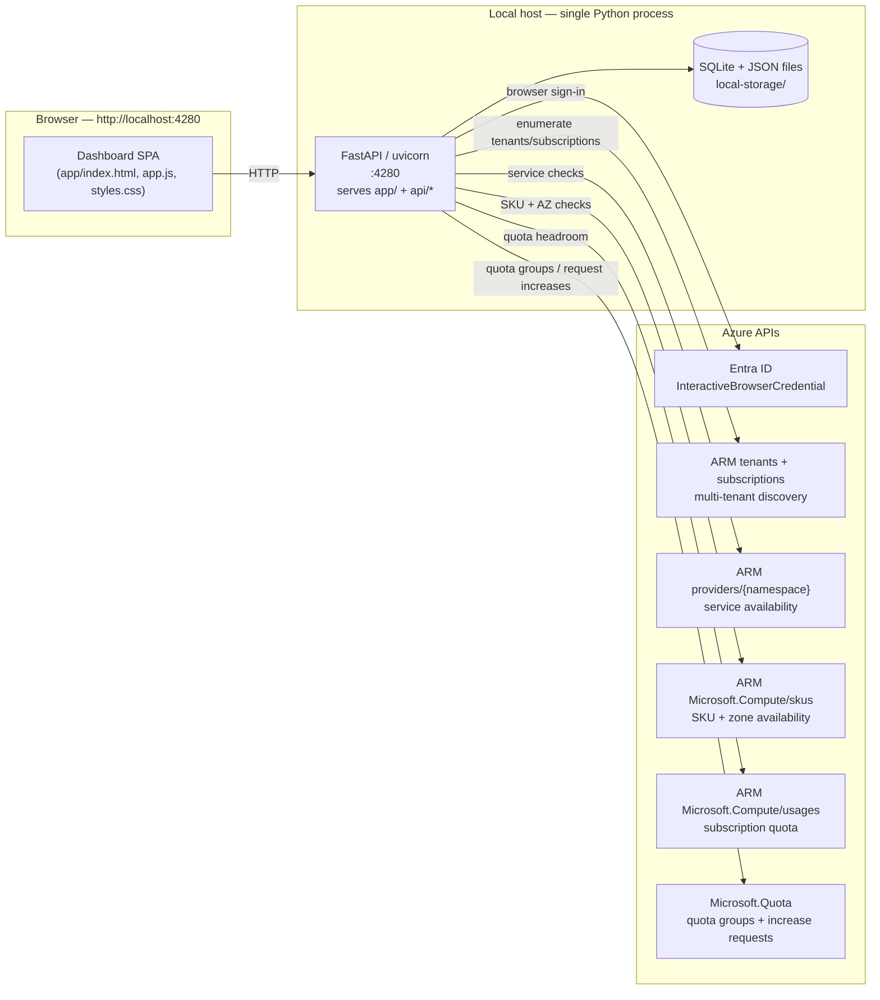

# Azure BOM Region Support Dashboard — local mode

Interactive web app for evaluating Azure region and zone readiness against a customer Bill of Materials (BOM). It runs entirely on your laptop as a single FastAPI/uvicorn process, uses local SQLite + JSON storage, and signs in with a one-time browser prompt through `azure-identity`.

The dashboard combines live Azure control-plane signals with BOM requirements to produce a reusable analysis snapshot for each run. It is now **ARM-only**: SKU and quota intelligence come from Azure Resource Manager APIs such as `Microsoft.Compute/skus`, `Microsoft.Compute/locations/*/usages`, `get-azvmskuavailability`, and `Microsoft.Quota`.

The result powers the **Overview**, **Table**, **Map**, **Latency Chart**, **Compare**, **Quota per Region**, and **Settings** tabs.

---

## TL;DR — already set up?

```powershell
cd C:\path\to\Azure-BOM-Region-Dashboard
.\start-local.ps1
```

Open <http://localhost:4280/>. Press `Ctrl+C` in the launcher window to stop the app.

---

## Setup guide (first-time, ~10 minutes)

This is a Windows / PowerShell guide. On macOS/Linux, only the venv activation command changes.

### Step 1 — Install prerequisites

You need these tools on `PATH`:

| Tool | Min version | Install | Check |
|---|---|---|---|
| **Git** | any | <https://git-scm.com/download/win> | `git --version` |
| **Python** | 3.10 – 3.12 | <https://www.python.org/downloads/> | `python --version` |
| **PowerShell** | 5.1+ / 7+ | preinstalled on Windows | `$PSVersionTable.PSVersion` |

Verify:

```powershell
git --version; python --version
```

> ℹ️ No Azure CLI required. Sign-in is handled in-app through `azure-identity` `InteractiveBrowserCredential`.

> ℹ️ No Node.js, Azurite, SWA CLI, or Functions Core Tools required. The dashboard is a single local Python process with on-disk SQLite + JSON storage.

### Step 2 — Clone the repo

```powershell
cd C:\CapacityPlanning   # or wherever you keep code
git clone https://github.com/bbabcock1990/Azure-BOM-Region-Dashboard-Public.git
cd Azure-BOM-Region-Dashboard-Public
```

### Step 3 — Create the Python virtual environment

```powershell
python -m venv .venv
.\.venv\Scripts\Activate.ps1                  # macOS/Linux: source .venv/bin/activate
pip install --upgrade pip
pip install -r api\requirements.txt -r requirements-dev.txt
```

If PowerShell blocks activation:

```powershell
Set-ExecutionPolicy -Scope CurrentUser -ExecutionPolicy RemoteSigned
```

Optional smoke check:

```powershell
python -m pytest --collect-only -q | Select-Object -Last 1
```

### Step 4 — Sign-in (handled in-app)

There is **no `az login` step**.

On first use, the dashboard opens a browser window and signs you in through `InteractiveBrowserCredential`. The token cache is persisted locally, so later launches are usually silent. The temporary auth tab auto-closes after sign-in.

The app also discovers **all tenants** you can access, then enumerates subscriptions across those tenants so guest-access subscriptions are available in the BOM editor.

### Step 5 — Launch the dashboard

```powershell
.\start-local.ps1
```

Expected startup:

```text
==> Checking required tools
    Python present
    Python venv present
==> Starting dashboard on http://localhost:4280/
INFO:     Uvicorn running on http://127.0.0.1:4280 (Press CTRL+C to quit)
```

| Component | Port | Purpose |
|---|---:|---|
| Dashboard host (FastAPI/uvicorn) | 4280 | Serves `app/` and `/api/*` |

### Step 6 — Your first analysis

1. In **Bills of Materials**, click **+ New**.
2. Fill in the BOM:
   - **BOM Name**
   - **Customer name** (optional but recommended)
   - **Subscriptions** — choose one or more from the auto-loaded multi-select list
   - **Services**
   - **Regions**
   - **Required SKUs & cores**
   - The editor no longer requires manual subscription ID entry and no longer includes customer segments
3. Click **Save**.
4. Select the BOM, then click **▶ Refresh analysis** → **Run analysis**.
5. On your first run, complete the browser sign-in if prompted.
6. When the run completes, explore the snapshot in the app tabs.

---

## Features

### Deployment verdicts

Each region gets a clear **Deployment Verdict**:

- **Ready**
- **Ready with constraints**
- **Not recommended**
- **Needs validation**

Verdicts combine BOM service coverage, 3-zone SKU coverage, subscription restrictions, and quota signals into a single deployment-readiness view.

### Multi-tenant subscription discovery

- One-time browser sign-in only
- No Azure CLI dependency
- Enumerates **all accessible tenants**
- Discovers subscriptions across home and guest tenants
- BOMs can target **multiple subscriptions**

### Quota management

The **Quota per Region** experience now supports:

- **Tiered quota checking**: subscription-level quota first, then quota groups, then cross-subscription headroom as an informational signal
- **Inline quota increase requests** from the dashboard via **Microsoft.Quota**
- **Pending Quota Requests** panel with polling for approval status
- **Toast notifications** for submit / pending / approved / failed states

> ⚠️ Microsoft.Quota requests are rate-limited to **1 request per subscription per region per hour**. Plan quota submissions accordingly.

### BOM analysis improvements

- **BOM Sensitivity Analysis** highlights which services, SKU families, or 3-zone requirements most constrain regional eligibility
- **Snapshot Diff Comparison** compares two saved analysis snapshots side by side
- BOM editor loads live SKU family IDs from Azure so required-family entries stay aligned with current `Microsoft.Compute/skus` data

### Retired UI elements

- **DR Region Pairs** tab removed
- **Quota Remediation** table removed in favor of inline **Request Increase**

### Tabs

- **Overview**
- **Table**
- **Map**
- **Latency Chart**
- **Compare**
- **Quota per Region** — includes a collapsible **Quota Hierarchy** tree visualizing the Quota Group → SKU Family → Subscription → SKU relationship with live quota data, plus a **Donor Subscriptions** panel that auto-scans non-BOM subscriptions for available quota that could be reassigned via quota groups
- **Settings**

### Filters

- **Verdict**: Ready / Ready with constraints / Not recommended / Needs validation
- **Geo / Continent**
- **SKU Selection**
- **Zone Restrictions**
- **Subscription**

---

## Troubleshooting setup

| Symptom | Fix |
|---|---|
| `Missing required tool: python` | Install Python and reopen PowerShell. |
| Browser sign-in fails or gets blocked by Conditional Access | Open the **Sign in** chip in the header and complete the interactive browser prompt. |
| No subscriptions appear in the BOM editor | Sign in first. The app only lists subscriptions visible to your account across accessible tenants. |
| A customer subscription is missing | Make sure your account has access in that tenant/subscription, then use **Switch directory / account** and sign in again. |
| `Port 4280 already in use` | Find the PID with `Get-NetTCPConnection -LocalPort 4280` and stop it with `Stop-Process -Id <pid>`. |
| Quota increase request is rejected or stays pending | Check the **Pending Quota Requests** panel, verify you have permission on the subscription, and remember the Microsoft.Quota 1/hour per sub+region limit. |
| Browser shows old HTML/CSS/JS | Hard-refresh with **Ctrl+F5**. |
| `running scripts is disabled` when activating venv | Run `Set-ExecutionPolicy -Scope CurrentUser -ExecutionPolicy RemoteSigned` once. |
| Snapshot picker is empty | No runs yet. Save a BOM and run **Refresh analysis**. |
| Want to wipe local state | Stop the app, delete `local-storage\`, then relaunch. |

---

## Architecture



### Which subscription is used for what

| Call | URL shape | Subscription context | Notes |
|---|---|---|---|
| Tenant discovery | `/tenants` | none | Finds every tenant the signed-in user can access. |
| Subscription discovery | `/subscriptions` | token per tenant | Aggregates subscriptions across home and guest tenants. |
| Service availability | `/providers/{namespace}?api-version=...` | none | Tenant-agnostic ARM provider metadata. |
| SKU & zone availability | `/subscriptions/{sub}/providers/Microsoft.Compute/skus?...` | selected BOM subscriptions | Primary source for SKU availability, zonal coverage, and subscription restrictions. |
| Subscription quota | `/subscriptions/{sub}/providers/Microsoft.Compute/locations/{region}/usages` | selected BOM subscriptions | Tier 1 quota check. |
| Quota groups | `/subscriptions/{sub}/providers/Microsoft.Quota/groupQuotas?...` | selected BOM subscriptions | Tier 2 quota-group headroom where available. |
| Quota increase request | `/subscriptions/{sub}/providers/Microsoft.Compute/locations/{region}/providers/Microsoft.Quota/quotas/{family}` | selected subscription + region | Submitted inline from the dashboard. |

**Net:** the app is now **ARM-only**. BOM analysis, SKU coverage, quota checks, and quota remediation all flow through Azure management APIs discovered through the signed-in user's accessible tenants and subscriptions.

---

## Local architecture notes

- Single-process local app: **FastAPI/uvicorn on port 4280**
- Frontend: static `app/` assets (no build step)
- Persistence: **SQLite + JSON files** under `local-storage\`
- Primary backend entrypoint: `python -m server`
- Main test command: `python -m pytest -q`
