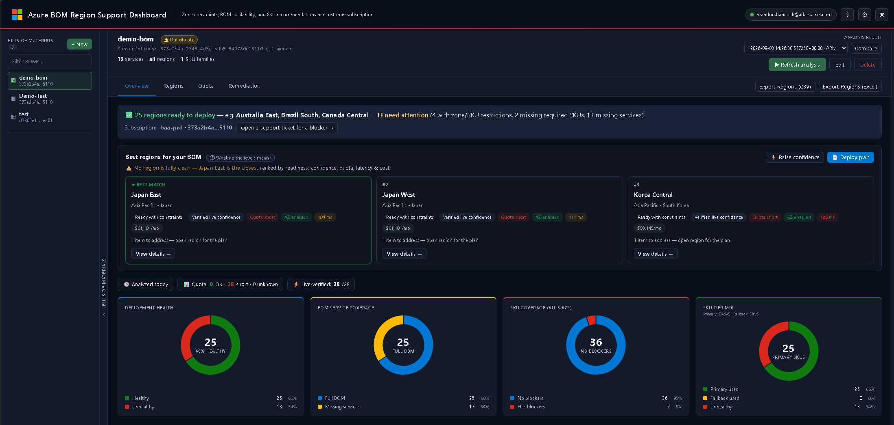
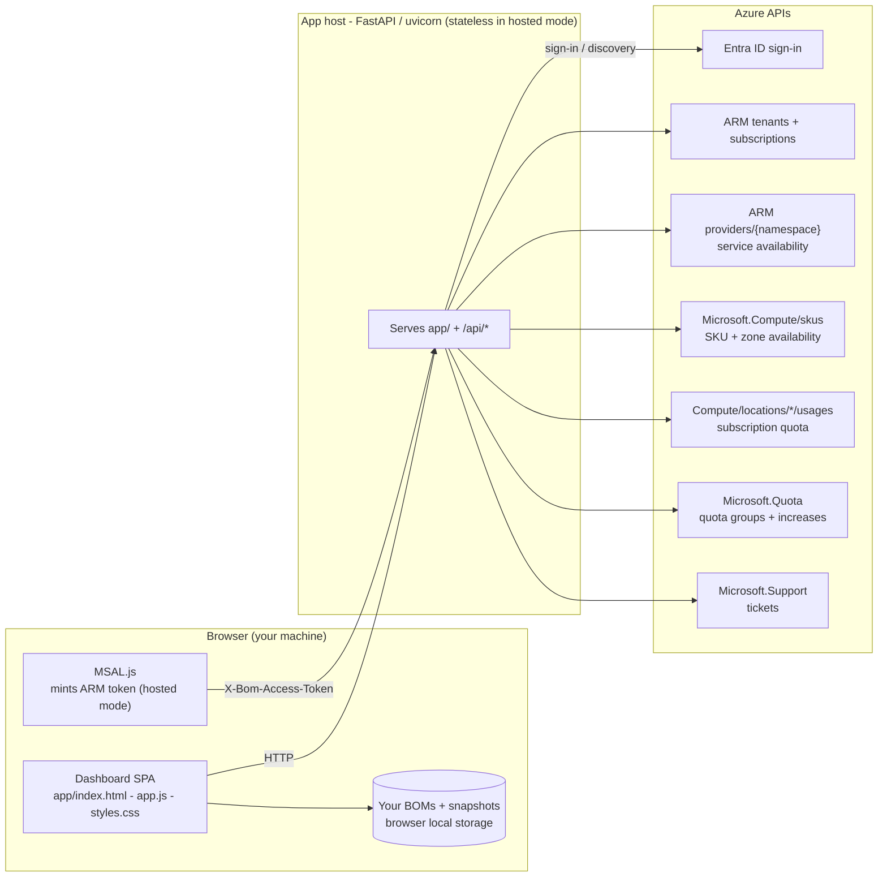

# Azure BOM Region Support Dashboard

**Plan where a customer's Azure deployment can actually land.** You describe a
Bill of Materials (BOM) — the services, VM SKUs, cores and regions a workload
needs — and the dashboard checks it live against Azure to tell you, per region:
is it **ready to deploy**, where are you **short on quota**, which **SKUs are
zone-restricted**, what's **missing**, and which regions are the **best match**.
When something is blocked, it can open and track the **Azure support ticket**
(quota increase or zonal/restricted-SKU access) for you.



---

## 🚀 Quick start (hosted — no install)

The fastest way to try it. Nothing to download, no Python, no setup.

1. Open the hosted app:
   **<https://bom-tool-demo.mangoglacier-e196c6d6.westus2.azurecontainerapps.io/>**
2. Click **Sign in** and authenticate with **your own Azure account** (any
   tenant — the app is multi-tenant). You're only granting read access to the
   subscriptions you already have.
3. Prefer to look before signing in? Click **▶ Explore with sample data** on the
   welcome screen to load a bundled, scrubbed example BOM and analysis — no Azure
   connection needed.
4. Click **+ New**, build a BOM (name, subscription(s), services, regions, SKUs),
   **Save**, then **▶ Refresh analysis**.
5. Read the results in **Overview → Regions → Quota → Remediation**.

> **Your data stays yours.** In the hosted app the server is **stateless** — your
> browser mints the Azure token and the server never stores your BOMs, tokens or
> analysis. See [Data & privacy](#data--privacy). Your work is saved in *your
> browser* and can be exported/imported as a `.zip` at any time.

Want it fully on your own machine or in your own tenant instead? Jump to
[Run it yourself](#-run-it-yourself-local-or-self-hosted).

---

## What you're looking at

The screenshot above is a live analysis of the `demo-bom` example. Reading it:

- **Left rail — Bills of Materials.** Every BOM you've created. Click one to load
  its latest analysis. **+ New** starts the BOM wizard.
- **Header.** The selected BOM, its target subscriptions, and a summary line
  (`13 services · all regions · 1 SKU families`). **Refresh analysis** re-runs the
  live checks; **Edit**/**Delete** manage the BOM. The **Analysis result** picker
  lets you switch between saved snapshots and **Compare** two of them.
- **Readiness banner.** *"25 regions ready to deploy … 13 need attention"* — a
  one-line verdict with a shortcut to **Open a support ticket for a blocker**.
- **Best regions for your BOM.** The top three regions ranked by readiness,
  confidence, quota, latency and estimated cost, each with a badge set
  (*Ready with constraints*, *Verified live confidence*, *Quota short*,
  *AZ-enabled*, latency, `$/mo`). **Raise confidence** re-verifies the ranking
  live; **Deploy plan** summarizes the recommendation.
- **Cockpit donuts.** At-a-glance health: **Deployment health** (ready vs not),
  **BOM service coverage** (regions with the full service set), **SKU coverage
  (all 3 AZs)**, and **SKU tier mix** (primary vs fallback family usage).

---

## How the dashboard works

End-to-end, a run is four steps:

### 1. Sign in
You authenticate with your Azure account. In the hosted app this uses
**MSAL.js in your browser** to mint an Azure Resource Manager (ARM) token, which
is sent per-request and used only for that request — the server keeps nothing.
Running locally, it uses `azure-identity`'s `InteractiveBrowserCredential`
(the same client `az login` uses) with a one-time browser prompt.

The app then discovers **every tenant** you can access and enumerates
**subscriptions across all of them**, so guest-tenant subscriptions show up in the
BOM editor too.

### 2. Describe the BOM
A BOM captures what the workload needs:

- **Services** (e.g. Azure Firewall, Azure SQL, AKS) — checked for regional
  availability.
- **Required SKUs & cores** — VM families (e.g. `Dav6`, `DASv5`) with a required
  core count and an optional fallback family.
- **Regions** — the candidate regions to evaluate (or *all* regions).
- **Subscriptions** — one or more; a single BOM can span subscriptions.
- **Resilience** — e.g. zone-redundant, which drives the 3-availability-zone
  coverage checks.

### 3. Analyze against live Azure (ARM-only)
On **Refresh analysis** the server queries Azure Resource Manager and combines
the signals into a per-region **deployment verdict**:

| Signal | Azure source |
|---|---|
| Service availability | `providers/{namespace}` resource-type locations |
| SKU + zone availability, subscription restrictions | `Microsoft.Compute/skus` |
| Subscription quota (headroom) | `Microsoft.Compute/locations/{region}/usages` |
| Quota groups | `Microsoft.Quota/groupQuotas` |
| Zone-redundant capability (disks, SQL, flex servers, Elastic SAN, …) | per-service ARM capability APIs |

Each region is scored and gets one of:

- **Ready** — everything the BOM needs is available.
- **Ready with constraints** — deployable, but with caveats (e.g. quota short, a
  fallback SKU, or a zone restriction to work around).
- **Not recommended** — a hard blocker (missing service or SKU).
- **Needs validation** — a signal couldn't be confirmed live.

The full result is saved as a reusable **snapshot** so you can revisit or compare
runs without re-querying Azure.

### 4. Review, verify, and act
- **Overview** — the readiness banner, best-region ranking, and health donuts.
- **Regions** — the full per-region table (plus **Map**, **Latency Chart**, and
  **Compare** sub-views).
- **Quota** — tiered quota picture with a **Quota Hierarchy** tree and a
  **Donor Subscriptions** scan for reusable headroom; request increases inline.
- **Remediation** — turn a blocker into an **Azure support ticket**.

**Confidence & live verification.** Some verdicts start at *Freshness unknown*
(derived from cached/catalog data). Clicking **Raise confidence** re-checks those
regions against Azure right now; verified regions show **Verified live
confidence**. The confidence dot beside each region encodes this — see the
**What do the levels mean?** legend in the app.

---

## Features

### Automated Azure support tickets
The **Remediation** tab turns a deployment blocker into a real Azure support
request through the `Microsoft.Support` ARM provider — using the same token the
app already holds:

- **Quota-increase** tickets (not enough vCPU quota for a family in a region).
- **Zonal / restricted-SKU access** tickets (a subscription restricted for a SKU
  in a specific availability zone).

Tickets are **dry-run first**: **Preview** builds the exact ARM request with no
Azure call; **Submit to Azure** files it after a confirmation. Every ticket —
preview or real — is tracked, and real ones can be status-refreshed. Contact
defaults live under **Settings → Ticket owner**.

### Best-region recommendation
The top regions are ranked by a blend of readiness, live-verified confidence,
quota headroom, latency, and estimated monthly cost — so "where should this go?"
has a defensible answer, not a guess.

### Quota management
- Tiered checks: subscription usage → quota groups → cross-subscription headroom.
- Inline **quota-increase requests** via **Microsoft.Quota**, with a
  **Pending Requests** panel and status polling.
- A **Donor Subscriptions** scan that finds spare quota elsewhere that could be
  reassigned via quota groups.

> ⚠️ Microsoft.Quota requests are rate-limited to **1 per subscription per region
> per hour**.

### Permissions pre-flight
**Settings → Permissions** runs a **read-only** access check: it lists the
signed-in account's effective permissions on a subscription and shows, per
required/optional capability, whether you're **Verified** or need to **Check**
access — so you know up front whether reads, quota requests, and ticket creation
will work.

### Snapshots: back up, move, restore
**Settings → Data & storage** lets you **Download snapshots (.zip)** and
**Import snapshots (.zip)** — a portable backup that carries both your analysis
history **and** your BOM definitions, so you can move work between machines or
restore it after clearing your browser. (Self-hosted local mode also gets an
**Open snapshots folder** button.)

### BOM analysis extras
- **Sensitivity analysis** — which services, SKU families, or 3-zone requirements
  most constrain regional eligibility.
- **Snapshot diff** — compare two saved runs side by side.
- Live SKU-family IDs loaded from `Microsoft.Compute/skus` so required-family
  entries always match current Azure values.

### Tabs at a glance
| Tab | What it shows |
|---|---|
| **Overview** | Readiness banner, best-region ranking, health donuts |
| **Regions** | Per-region verdict table + **Map**, **Latency Chart**, **Compare** |
| **Quota** | Tiered quota, Quota Hierarchy tree, Donor Subscriptions, inline increases |
| **Remediation** | Preview/submit/track Azure support tickets |
| **Settings** | Ticket owner · Permissions · Model datasets · Cost & pricing · Activity log · Data & storage |

Filters: verdict, geo/continent, SKU selection, zone restrictions, subscription.

---

## Data & privacy

The hosted deployment is designed for **multiple customers at once** and stores
**no customer data server-side**:

- The server runs in **delegated (stateless) mode**. Your browser signs in with
  **MSAL.js** and forwards the ARM token per request (`X-Bom-Access-Token`); the
  server uses it only to answer that request and then discards it.
- Your BOMs and analysis snapshots live in **your browser** and are synced to
  local storage — not on the server. Export them to a `.zip` any time.
- Analysis is **read-only** against Azure, except for the two explicit write
  actions you trigger yourself: submitting a quota-increase request and filing a
  support ticket (both preview-first, with confirmation).

---

## 🖥️ Run it yourself (local or self-hosted)

Prefer to run in your own environment? The exact same app runs as a single local
Python process, in Docker, or as a container in your own Azure.

### Option A — Docker (least setup)

```powershell
docker compose up --build
```

Serves on <http://localhost:4280/>. State persists in the `bomdash-data` volume.
Set `DEMO_MODE=true` to seed sample data.

### Option B — Local Python

```powershell
git clone https://github.com/bbabcock1990/Azure-BOM-Region-Dashboard-Public.git
cd Azure-BOM-Region-Dashboard-Public
python -m venv .venv
.\.venv\Scripts\Activate.ps1                 # macOS/Linux: source .venv/bin/activate
pip install --upgrade pip
pip install -r api\requirements.txt -r requirements-dev.txt
.\start-local.ps1
```

Open <http://localhost:4280/>. Press `Ctrl+C` in the launcher to stop.

**Prerequisites:** Git and Python 3.10–3.12 on `PATH`. No Azure CLI, Node.js,
Azurite, or Functions Core Tools required — sign-in is handled in-app via
`azure-identity`, and the frontend is static (no build step).

### Demo / sample mode
Set `DEMO_MODE=true` before launching (any option) to seed a scrubbed sample BOM
+ snapshot so the dashboard is fully populated **before** any Azure sign-in. A
banner marks demo mode and support-ticket submission is disabled.

### If sign-in is blocked by Conditional Access (AADSTS53003)
By default local mode signs in with the **Azure CLI** first-party client
(`04b07795-8ddb-461a-bbee-02f9e1bf7b46`), so no app registration is needed. If a
tenant's Conditional Access policy blocks that app you'll see **AADSTS53003**.
Point the app at a dedicated app registration instead:

```powershell
$env:AZURE_CLIENT_ID    = "<your-app-registration-client-id>"
$env:AZURE_TENANT_ID    = "<your-tenant-id>"      # optional
$env:AZURE_REDIRECT_URI = "http://localhost"      # must match the registration
```

The app registration needs a **Mobile & desktop** platform with redirect
`http://localhost` (public client flows = Yes) and the delegated **Azure Service
Management → user_impersonation** permission (admin-consented if required).

---

## Architecture



- **Frontend:** static `app/` single-page app (no build step).
- **Backend:** FastAPI/uvicorn serving `app/` and `/api/*`; entrypoint
  `python -m server`.
- **Storage:** hosted mode is stateless (state lives in the browser and is
  exportable). Local mode persists to **SQLite + JSON** under `local-storage/`.
- **Azure access:** ARM-only. BOM analysis, SKU coverage, quota checks,
  remediation, and support tickets all flow through management APIs scoped to the
  signed-in user's tenants and subscriptions.

### Which subscription is used for what

| Call | URL shape | Subscription context |
|---|---|---|
| Tenant discovery | `/tenants` | none |
| Subscription discovery | `/subscriptions` | token per tenant |
| Service availability | `/providers/{namespace}?api-version=…` | none |
| SKU & zone availability | `/subscriptions/{sub}/providers/Microsoft.Compute/skus?…` | selected BOM subscriptions |
| Subscription quota | `/subscriptions/{sub}/providers/Microsoft.Compute/locations/{region}/usages` | selected BOM subscriptions |
| Quota groups | `/subscriptions/{sub}/providers/Microsoft.Quota/groupQuotas?…` | selected BOM subscriptions |
| Quota increase | `…/locations/{region}/providers/Microsoft.Quota/quotas/{family}` | selected sub + region |
| Support ticket | `/subscriptions/{sub}/providers/Microsoft.Support/…` | selected subscription |

---

## Troubleshooting

| Symptom | Fix |
|---|---|
| Sign-in blocked by Conditional Access (**AADSTS53003**) | The tenant blocks the Azure CLI app. Set `AZURE_CLIENT_ID` (+ `AZURE_TENANT_ID`, `AZURE_REDIRECT_URI`) to a dedicated app registration — see the CA section above. |
| No subscriptions in the BOM editor | Sign in first; only subscriptions visible to your account across accessible tenants are listed. |
| A customer subscription is missing | Ensure your account has access in that tenant, then **Switch account/directory** and sign in again. |
| A best-region confidence stays gray / *Freshness unknown* | Click **Raise confidence** to live-verify those regions. |
| Quota increase rejected or stuck pending | Check **Pending Requests**, confirm subscription permission (use **Settings → Permissions**), and mind the 1/hour per sub+region limit. |
| Imported a `.zip` but BOMs don't appear | Re-export from the current version and re-import; then hard-refresh. |
| Browser shows stale UI | Hard-refresh with **Ctrl+Shift+R** (or **Ctrl+F5**). |
| `Port 4280 already in use` (local) | `Get-NetTCPConnection -LocalPort 4280`, then `Stop-Process -Id <pid>`. |
| `running scripts is disabled` when activating venv | Run `Set-ExecutionPolicy -Scope CurrentUser -ExecutionPolicy RemoteSigned` once. |
| Want to wipe local state | **Settings → Data & storage → Wipe local state** (or delete `local-storage/` when self-hosting). |

---

## Development

```powershell
python -m pytest -q          # run the test suite
node --check app\app.js      # lint the SPA entrypoint
python -m server             # run the backend directly
```

- Frontend: static `app/` assets — edit and hard-refresh, no build step.
- Backend: `api/` endpoints registered in `server/app.py`; shared logic in
  `api/_shared/`.
